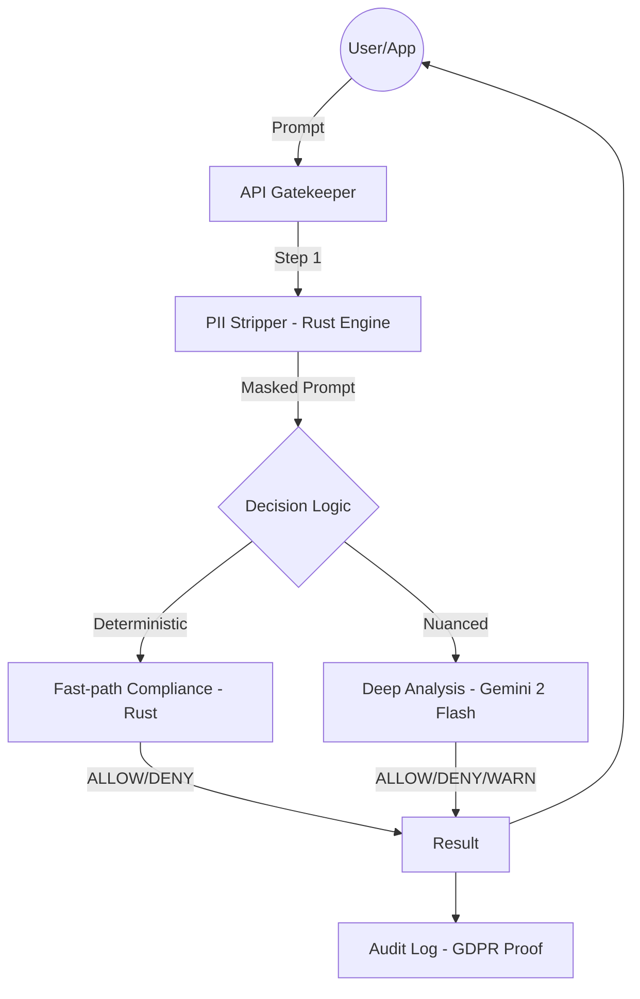

# EU AI Act Validator API

[](https://github.com/Tex0711/eu-ai-act-validator-api/actions/workflows/ci.yml)

High-performance EU AI Act compliance API: real-time risk assessment with Gemini 2 Flash. Privacy-by-design: PII stripped before processing.

*Repository: `eu-ai-act-validator-api` · Product: ComplianceCode.eu*

## ✨ Key Features

- **🚀 Ultra-Low Latency:** High-performance Rust engine performs core compliance checks in <50ms, making it suitable for real-time API gateways.
- **Privacy-by-design:** PII stripped before processing; only anonymized placeholders used for compliance checks. No PII stored.
- **Accuracy:** Validated against 36+ EU AI Act scenarios; safety-first defaults (DENY/WARNING on errors).
- **Enterprise-ready:** Fully containerized; run in your Private Cloud (Azure, AWS) or on-premise for data sovereignty.

### 🛡️ Built for Digital Sovereignty (NL/EU)

While many governance platforms offer high-level dashboards, ComplianceCode provides the technical enforcement needed for true digital sovereignty.

- **Local Expertise:** Deeply optimized for Dutch and European PII patterns (BSN, Codice Fiscale, Steuer-ID, etc.).
- **In-Process Security:** Sensitive data is stripped before it ever leaves your infrastructure, ensuring compliance with the highest standards of the Dutch Data Protection Authority (Autoriteit Persoonsgegevens / AP).
- **The Perfect Companion:** Designed to work alongside governance tools like VerifyWise. They handle the policy; we handle the real-time execution at <50ms latency.

### 🏢 Enterprise Readiness

- **Model-Agnostic Architecture:** The compliance engine uses an `LLMProvider` interface so you can switch between Gemini (default), Mock (local/testing without API costs), or future providers (e.g. Claude, local models) via the `LLM_PROVIDER` environment variable.
- **Detailed Audit Trails:** Every request produces an audit report with `timestamp`, `detected_pii_types` (e.g. `['EMAIL','ID']`), `latency_ms`, and the **masked prompt** only. The original prompt is never stored (GDPR-compliant). Optional `GET /api/v1/health` reports API status, active LLM provider, and database connectivity.

### Supported Regions

Primary support for **EU & US**. International roadmap (APAC/LATAM) is in progress. See [docs/INTERNATIONAL_ROADMAP.md](docs/INTERNATIONAL_ROADMAP.md) and `npm run test:pii:international` for current coverage and gaps.

## 🚀 Quick Start

### 🐳 Quick Start (Docker - Recommended)

The fastest way to get the API running is using Docker:

1. **Setup env:** Copy `.env.example` to `.env` and fill in your keys (Supabase, Gemini, OpenAI, API_KEY).
2. **Launch:**

```bash
docker compose up --build -d
```

3. **Verify:**

```bash
curl http://localhost:3000/api/health
```

The API is available at `http://localhost:3000/api/v1/gatekeeper`. For more Docker options (e.g. Enterprise & On-Premise), see [Enterprise & On-Premise](#-enterprise--on-premise) below.

### 🛠️ Manual Installation (Development)

For developers who prefer to run the stack locally without Docker:

#### Prerequisites

- Node.js 18+
- Supabase account with pgvector extension enabled
- Google Gemini API key
- OpenAI API key (for embeddings)

#### Installation

```bash
npm install
```

#### Environment Setup

Copy `.env.example` to `.env` and fill in your credentials:

```bash
cp .env.example .env
```

Required environment variables:
- `SUPABASE_URL` - Your Supabase project URL
- `SUPABASE_SERVICE_ROLE_KEY` - Supabase service role key (for admin operations)
- `GEMINI_API_KEY` - Google Gemini API key for compliance evaluation
- `OPENAI_API_KEY` - OpenAI API key for text embeddings
- `API_KEY` - Your custom API key for endpoint authentication

#### Database Setup

1. Run the migration in your Supabase SQL editor:

```bash
# Copy contents of supabase/migrations/001_initial_schema.sql
# Execute in Supabase SQL Editor
```

2. Seed the database with EU AI Act content (see `scripts/seed-db.ts` for example)

#### Development

```bash
npm run dev
```

The API will be available at `http://localhost:3000/api/v1/gatekeeper`

## 📡 API Usage

### Endpoint

`POST /api/v1/gatekeeper`

### Authentication

Include your API key in the request header:

```
x-api-key: your_api_key_here
```

### Request

```json
{
  "prompt": "Create a system that uses facial recognition to track employees",
  "context": {
    "user_id": "user_123",
    "department": "HR"
  }
}
```

### Response

```json
{
  "decision": "DENY",
  "reason": "Facial recognition for employee tracking may violate Article 5(1)(d) prohibiting social scoring for employment purposes.",
  "article_ref": "Article 5",
  "audit_id": "550e8400-e29b-41d4-a716-446655440000"
}
```

### Response Codes

- `200` - Success
- `400` - Invalid request format
- `401` - Invalid or missing API key
- `429` - Rate limit exceeded (see `Retry-After` header)
- `500` - Internal server error

### Try it (curl)

Replace `BASE_URL` with your deployed API URL or `http://localhost:3000` when running locally:

```bash
curl -X POST "$BASE_URL/api/v1/gatekeeper" \
  -H "Content-Type: application/json" \
  -H "x-api-key: YOUR_API_KEY" \
  -d '{"prompt": "Write a poem about the sunset", "context": {}}'
```

### Try it (Postman)

Import **`docs/ComplianceCode-Gatekeeper.postman_collection.json`** into Postman or Insomnia to call Health and Gatekeeper without writing code. Set `BASE_URL` and `x-api-key` in the collection variables.

## 🏗️ Architecture



**Proprietary Hybrid Evaluation Engine:** Optimized for the EU AI Act. Our engine leverages a multi-stage validation process, combining deterministic rule-sets with advanced LLM reasoning to deliver sub-second responses and enterprise-grade cost efficiency.

**Benefits:**

- **Speed** – Many requests complete in under a second; full evaluation typically 2–4 s where nuance is required.
- **Cost efficiency** – Intelligent routing minimizes LLM calls without sacrificing accuracy.
- **Accuracy** – Validated against 36+ EU AI Act scenarios; safety-first defaults (DENY/WARNING on errors).

**Privacy-by-design:** PII is stripped before processing; only anonymized placeholders are used for compliance checks. No PII stored.

### Performance (benchmarks)

**PII stripping: zero-latency privacy.** For enterprise, the key metric is **P99 &lt; 1 ms**—even on a 2000-word, PII-dense prompt. The privacy layer adds no perceptible delay (an eye blink is 100–400 ms; our heavy-load PII check is ~0.32 ms).

PII stripper (100 consecutive calls, `npm run benchmark`). *Units in milliseconds (ms) for clarity:*

| Scenario       | Words | AVG (ms) | P99 (ms) |
|----------------|-------|----------|----------|
| Baseline       | 50    | 0.007    | 0.014    |
| Heavy Load (PII-dense) | 2000 | 0.32     | 0.40     |

*Same in µs: Baseline ~7 µs / ~14 µs; Heavy ~320 µs / ~400 µs.*

Full pipeline:

| Scenario              | Typical latency | Notes        |
|-----------------------|-----------------|-------------|
| PII stripping         | &lt; 1 ms        | P99 &lt; 1 ms even at 2000 words; effectively zero-latency |
| Deterministic checks  | &lt; 800 ms     | Rule-based  |
| Full LLM evaluation  | typically 2–4 s | When needed (Gemini) |
| Accuracy (36 scenarios) | 100%          | See `npm run test:accuracy` |

## 🎯 Technical Highlights

### Performance & Scalability

ComplianceCode.eu uses a hybrid architecture. While LLMs provide reasoning, our dedicated Rust Engine handles the heavy lifting.

- **Zero-latency privacy:** PII stripping is P99 &lt; 1 ms (0.32 ms typical for 2000 words). No reason to skip it—it doesn’t slow the system down.
- **Speed:** &lt;50 ms per check (core compliance path).
- **Scale:** Stress-tested for 500+ concurrent users with 0% failure rate; PII stripping uses minimal CPU, so thousands of requests/sec are feasible on modest hardware.

## 📊 Database Schema

### compliance_knowledge

Stores chunks of EU AI Act text with vector embeddings for semantic search.

### audit_logs

Complete audit trail including:
- **Prompt (masked)** – PII stripped; only placeholders stored (data minimization)
- Decision (ALLOW/DENY/WARNING)
- Reasoning
- Article references
- Response time

## 🔒 Security

- API key authentication required
- **Rate limiting:** 60 requests/minute per API key (configurable via `RATE_LIMIT_REQUESTS_PER_MINUTE`). 429 + `Retry-After` when exceeded. See `docs/RATE_LIMIT_AND_ANOMALY.md`.
- **Anomaly metrics:** Per request, structured JSON is logged (identifier redacted, prompt length, response time, decision) for later anomaly detection.
- All requests logged for audit purposes
- Environment variables for sensitive data
- Safety-first error handling (defaults to DENY on failures)

## 📚 Documentation

- **`docs/`** – Setup, troubleshooting, testing, deployment:
  - `docs/INTERNATIONAL_ROADMAP.md` – v1.0 EU/US full; v1.1 APAC/LATAM planned
  - `docs/PII_PRIVACY_WORKFLOW.md` – PII stripping order, placeholders, EU/US patterns
  - `CHANGELOG.md` – Release notes (v1.0.0)
  - `docs/ACCURACY_TEST_LLM.md` – 36-scenario accuracy test (target 100%)
  - `docs/STRESS_TEST_K6.md` – k6 load test (phases, thresholds), Postman collection
  - `docs/ComplianceCode-Gatekeeper.postman_collection.json` – Postman collection (Health + Gatekeeper)
  - `docs/QUICK_START.md`, `docs/ENV_SETUP.md`, `docs/OPENAI_SETUP.md` – Setup
  - `docs/TROUBLESHOOTING.md` – Common issues
  - `docs/PDF_EXPORT_INSTRUCTIONS_EN.md` – PDF export instructions

## 🤖 CI / GitHub Actions

Workflow: `.github/workflows/ci.yml` (on every push/PR to `main` or `master`).

**Steps:** build → compliance test (engine) → start server → accuracy test (gatekeeper API) → load test (light).

**Repository secrets (Settings → Secrets and variables → Actions):**

- `API_KEY` – API key for the gatekeeper (same value as in `.env`)
- `GEMINI_API_KEY` – Google Gemini API key
- `SUPABASE_URL` – Supabase project URL (for compliance test + server)
- `SUPABASE_SERVICE_ROLE_KEY` – Supabase service role key
- `OPENAI_API_KEY` – OpenAI API key (for embeddings in compliance engine)

Without these secrets, the compliance, accuracy, or load test will fail in CI.

## 🚢 Deployment

**Beta quick deploy:** see **`docs/DEPLOY_BETA.md`** for steps (Railway, Render, or Fly.io). Build: `npm run build`. Start: `npm run start` (expects `PORT`). All secrets via environment variables; no `.env` in production.

## 🏢 Enterprise & On-Premise

The API is **fully containerized** and can run in a **Private Cloud** (Azure, AWS, or on-premise) to guarantee **data sovereignty**. No data has to leave your network except calls to Supabase and LLM providers that you manage or host in the same region.

### Docker

- **Dockerfile:** multi-stage build (Node/Astro API + Rust compliance engine). Based on `node:20-slim`.
- **Start the full stack locally:**

```bash
cp .env.example .env
# Set SUPABASE_*, GEMINI_API_KEY, OPENAI_API_KEY, and API_KEY in .env
docker compose up -d
```

The API is available at `http://localhost:3000`. Health: `http://localhost:3000/api/health`.

### Scalability

**Proven stability under extreme load (500 concurrent users)** with **100% decision accuracy** and **0% failure rate**. Load tests (k6) run continuously in CI; you can run the heavy 500 VU test locally with `npm run test:load`.

## License

This project is licensed under the MIT License - see the [LICENSE](LICENSE) file for details.

